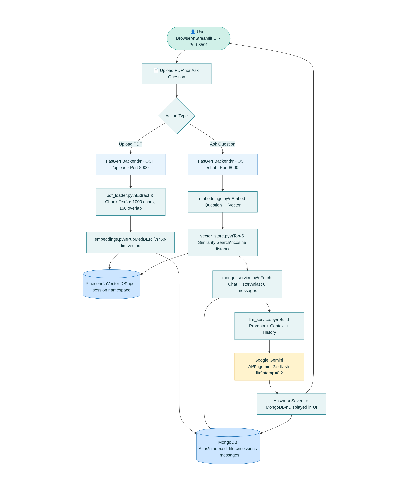

# 🩺 Healthcare RAG System

A **Patient Medical Record Assistant** that lets you upload medical PDFs and ask questions about them in plain language — powered by AI.

> Upload your lab report → Ask "What is my blood sugar level?" → Get a clear, document-based answer instantly.

---

## 🎥 Demo

[](https://drive.google.com/file/d/1zzFnGBCJA2MI-jYc337JARJkjYsDvh4G/view?usp=sharing)

---

## 📌 What This App Does

Most people struggle to understand their own medical documents — lab reports, prescriptions, doctor notes. This app solves that by letting you:

- **Upload** any medical PDF (lab report, prescription, clinical notes, discharge summary)
- **Ask questions** in plain English about your documents
- **Get accurate answers** pulled directly from your document — not from the internet
- **Manage multiple patient records** with separate sessions, rename, pin, and delete

The AI only answers from what's in your uploaded document. It will never diagnose, prescribe, or make up information.

---

## 🏗️ Architecture



### Services Inside the Backend

| Service | What it does |
|---|---|
| `pdf_loader.py` | Reads PDF pages and splits into overlapping chunks |
| `embeddings.py` | Converts text chunks into 768-dim vectors using PubMedBERT |
| `vector_store.py` | Saves and searches vectors in Pinecone |
| `llm_service.py` | Builds prompt and sends to Gemini, returns clean answer |
| `mongo_service.py` | All database operations — sessions, messages, files |

---

## 🔄 How It Works — Step by Step

### When you upload a PDF:

```
1. You upload a PDF
        ↓
2. Text is extracted from every page (pypdf)
        ↓
3. Text is split into overlapping chunks
   → Each chunk = ~1000 characters with 150 character overlap
   → Overlap ensures no sentence is cut off between chunks
        ↓
4. Each chunk is converted into a 768-number vector
   → Uses PubMedBERT — a model trained specifically on medical text
   → Medical terms like "HbA1c", "creatinine" are understood properly
        ↓
5. Vectors are stored in Pinecone
   → Each session has its own namespace (isolated storage)
   → File name and chunk index saved as metadata
        ↓
6. File info saved in MongoDB (file name, vector IDs, chunk count)
```

### When you ask a question:

```
1. You type a question
        ↓
2. Question is converted into a vector (same PubMedBERT model)
        ↓
3. Pinecone finds the top 5 most similar chunks from your document
   → Similarity is measured mathematically (cosine distance)
   → Only chunks from your session are searched
        ↓
4. Recycled (soft-deleted) documents are filtered out
        ↓
5. Recent chat history is fetched from MongoDB (last 6 messages = 3 pairs)
        ↓
6. A prompt is built:
   → System rules (never diagnose, never prescribe, etc.)
   → The 5 relevant chunks as context
   → Last 6 messages as conversation history
   → Your question
        ↓
7. Gemini reads the prompt and generates an answer
   → Only uses the provided context, not external knowledge
   → Temperature: 0.2 (focused, consistent answers)
        ↓
8. Answer saved to MongoDB and displayed in UI
   → Message timestamps (created_at) stored and shown in chat
```

---

## 📁 Project Structure

```
healthcare-rag-system/
│
├── backend/
│   ├── config.py                  ← All settings (API keys, model names, chunk size)
│   ├── main.py                    ← FastAPI app with CORS, registers all routes
│   │
│   ├── prompts/
│   │   └── healthcare_prompt.py   ← System prompt controlling MediAssist behaviour
│   │
│   ├── routes/
│   │   ├── upload.py              ← POST /upload
│   │   ├── chat.py                ← POST /chat
│   │   ├── history.py             ← Session management + chat history
│   │   └── document.py            ← Document recycle / restore / permanent delete
│   │
│   └── services/
│       ├── pdf_loader.py          ← PDF reading and chunking
│       ├── embeddings.py          ← PubMedBERT text → vector conversion
│       ├── vector_store.py        ← Pinecone upsert, search, delete
│       ├── llm_service.py         ← Gemini prompt building and answer generation
│       └── mongo_service.py       ← All MongoDB operations
│
├── frontend/
│   └── streamlit_app.py           ← Complete UI (light mint green theme)
│
├── data/
│   └── uploaded_pdfs/             ← Temporary storage for uploaded PDFs
│
├── architecture.png               ← System architecture diagram
├── .env                 
├── .gitignore                     ← Ignores .env, venv/, data/, __pycache__/
├── requirements.txt               ← All Python packages needed
└── README.md
```

---

## ⚙️ Setup & Installation

### Step 1 — Clone the repo

```bash
git clone https://github.com/your-username/healthcare-rag-system.git
cd healthcare-rag-system
```

### Step 2 — Create a virtual environment

```bash
python -m venv venv

# Activate it:
# Windows:
venv\Scripts\activate
# Mac / Linux:
source venv/bin/activate
```

You'll see `(venv)` at the start of your terminal. **Always activate this before running the app.**

### Step 3 — Install dependencies

```bash
pip install -r requirements.txt
```

### Step 4 — Set up your API keys

```bash
# Windows:
copy .env.example .env
# Mac / Linux:
cp .env.example .env
```

Open `.env` and fill in your keys:

```env
GEMINI_API_KEY=your_key_here
PINECONE_API_KEY=your_key_here
PINECONE_INDEX_NAME=healthcare-rag
MONGO_URI=your_mongodb_uri_here
MONGO_DB_NAME=healthcare_rag
BACKEND_URL=http://localhost:8000
```

**Where to get each key:**

| Key | Where to get it |
|---|---|
| `GEMINI_API_KEY` | [aistudio.google.com/app/apikey](https://aistudio.google.com/app/apikey) |
| `PINECONE_API_KEY` | [app.pinecone.io](https://app.pinecone.io) → API Keys |
| `PINECONE_INDEX_NAME` | Create an index: **768 dimensions**, **cosine** metric |
| `MONGO_URI` | MongoDB Atlas → Connect → Drivers → copy the URI |

### Step 5 — Run the backend

```bash
uvicorn backend.main:app --reload --port 8000
```

You should see: `Uvicorn running on http://127.0.0.1:8000`

### Step 6 — Run the frontend (new terminal)

```bash
# Activate venv in the new terminal first!
venv\Scripts\activate        # Windows
source venv/bin/activate     # Mac/Linux

streamlit run frontend/streamlit_app.py
```

Open **http://localhost:8501** in your browser. The app is ready.

> **Note:** MongoDB database and collections are created automatically on first use. No manual database setup needed.

---

## 🔌 API Endpoints

| Method | Endpoint | Description |
|---|---|---|
| `POST` | `/upload` | Upload and embed a medical PDF |
| `POST` | `/chat` | Ask a question about uploaded documents |
| `GET` | `/sessions/{user_id}` | Get all sessions for a user |
| `POST` | `/sessions/{user_id}/{session_id}` | Create a new session |
| `PUT` | `/sessions/{session_id}/rename` | Rename a session |
| `PUT` | `/sessions/{session_id}/pin` | Pin / unpin a session |
| `DELETE` | `/sessions/{user_id}/{session_id}/permanent` | Permanently delete a session |
| `GET` | `/history/{user_id}/{session_id}` | Get chat history for a session |
| `DELETE` | `/history/{user_id}/{session_id}` | Clear chat history |
| `GET` | `/session-files/{session_id}` | Get indexed and recycled files |
| `POST` | `/document/recycle` | Move a document to recycle bin |
| `POST` | `/document/restore` | Restore a document from recycle bin |
| `DELETE` | `/document/permanent` | Permanently delete a document + its Pinecone vectors |

---

## 🖥️ UI Features

- **Light mint green theme** — clean, professional interface (DM Sans font)
- **Patient Name** shown as the session title in main chat area
- **Message timestamps** — each chat bubble shows time (from MongoDB `created_at`)
- **How to Use guide** — shown on new record only, hidden after first PDF uploaded
- **Document recycle bin** — soft delete, restore, or permanently delete documents
- **Session delete with name confirmation** — must type session name exactly to confirm (safety guard)
- **Disclaimer shown once** — below the chat input bar, not repeated on every message

---

## 🛡️ AI Safety Rules

MediAssist is strictly controlled by its system prompt. It will:

- ✅ Only answer from your uploaded documents — never from external knowledge
- ❌ Never diagnose any condition
- ❌ Never prescribe or suggest medications
- ❌ Never recommend stopping or changing existing prescriptions
- 🚨 Immediately flag emergencies (chest pain, difficulty breathing, stroke symptoms) with "Call emergency services"

---

## 🧰 Tech Stack

| Layer | Technology |
|---|---|
| Frontend | Streamlit — light mint green theme, DM Sans font |
| Backend | FastAPI (Python) with CORS middleware |
| Embedding Model | PubMedBERT (`NeuML/pubmedbert-base-embeddings`) — 768 dim |
| LLM | Google Gemini 2.5 Flash Lite — temperature 0.2 |
| Vector Database | Pinecone — namespace isolated per session |
| Database | MongoDB Atlas — sessions, messages, files, recycle bin |
| PDF Processing | pypdf |

---

## 👨‍💻 Author

**Sakthi Prasanth**
Project: Patient Medical Record Assistant
